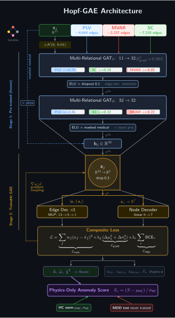

<div align="center">

# Hopf-GAE
## Physics-Informed Graph Neural Network for Normative Brain Dynamics

### Anomaly Detection in Major Depressive Disorder via Stuart-Landau–Grounded Denoising Graph Autoencoder with Two-Level Fisher LDA Scoring

[](https://www.python.org/) [](https://pytorch.org/) [](https://pyg.org/) []() []() []() []()

</div>

---

## Overview

This repository contains the **Hopf-GAE**, a physics-informed deep learning architecture that detects depression-related dynamical abnormalities without ever training on depressed brains. Rather than framing MDD detection as binary classification (which fails at $n = 19$), the model learns a **normative manifold** of healthy brain dynamics and scores MDD subjects by how far they deviate from it.

The key innovations:

1. **Biophysically grounded node features** — every node carries the per-region bifurcation parameter $a_j$, natural frequency $\omega_j$, and goodness-of-fit $\chi^2_j$ estimated by the Stuart-Landau / Hopf bifurcation framework via the [UKF-MDD](https://github.com/skaraoglu/UKF-MDD) pipeline, plus Yeo 7-network one-hot encodings (11 features per ROI).

2. **Multi-relational graph attention** — three edge types (PLV phase synchrony, MVAR Granger causality, SC structural connectivity) with learned per-relation attention weights.

3. **Denoising graph autoencoder** — Gaussian noise injection ($\sigma = 0.1$) on encoder input and dropout ($p = 0.3$) on the latent code replace the variational bottleneck, which collapsed in all tested configurations due to low within-HC variance of bifurcation parameters.

4. **Expanded reconstruction targets** — 7-dimensional per-node targets (3 physics + 4 connectivity-derived: PLV node strength, MVAR in/out-strength, within-network PLV) force the bottleneck to encode richer per-ROI structure.

5. **Two-level Fisher Linear Discriminant scoring** — data-driven combination of node dynamics and edge connectivity anomalies, with per-relation weighting at level 1 and node-vs-edge weighting at level 2. No manual tuning.

---

## The $n = 19$ Problem

<table>
<tr>
<td width="50%">

**Classification (insufficient data)**
- Binary classification: active NF vs. sham
- Trained on 18 subjects per fold
- Memorized subject identity → Cohen's $d$ of $-6$ to $-11$
- Implausibly large vs. UKF reference $d = -0.835$
- **Verdict:** classification fails at this sample size

</td>
<td width="50%">

**Normative anomaly detection (this work)**
- Train exclusively on healthy controls ($n = 295$ sessions)
- MDD subjects are test-only — never seen during training
- Overfitting eliminated by construction
- HC vs MDD: $d = +4.04$, $p = 3.9 \times 10^{-12}$
- All 4 intervention scales survive FDR correction
- HC holdout false positive rate: 0/36 (0.0%)
- **Verdict:** "how far from healthy?" not "which group?"

</td>
</tr>
</table>

---

## Architecture

<div align="center">

</div>

### Node Features (11-dimensional per ROI)

| Feature | Dim | Source | Meaning |
|---------|-----|--------|---------|
| $a_j$ | 1 | [UKF-MDD](https://github.com/skaraoglu/UKF-MDD) | Bifurcation parameter — distance from critical point |
| $\omega_j$ | 1 | Hilbert phase | Natural oscillation frequency (Hz) |
| $\chi^2_j$ | 1 | UKF fit | Goodness-of-fit (model–data agreement) |
| Network one-hot | 8 | Yeo 7 + Subcortical | Functional network membership |

### Reconstruction Targets (7-dimensional per ROI)

| Feature | Weight | Source | Purpose |
|---------|--------|--------|---------|
| $a_j$ | 2.0 | UKF | Primary clinical marker |
| $\omega_j$ | 1.0 | Hilbert | Oscillation dynamics |
| $\chi^2_j$ | 1.0 | UKF fit | Model–data agreement |
| PLV node strength | 0.5 | Edge aggregation | Phase synchrony profile |
| MVAR in-strength | 0.5 | Edge aggregation | Directed input connectivity |
| MVAR out-strength | 0.5 | Edge aggregation | Directed output connectivity |
| Within-network PLV | 0.5 | Edge aggregation | Intra-network coherence |

### Edge Types (3 relations)

| Relation | Type | Source | Encoder Weight (Conv₁) |
|----------|------|--------|------------------------|
| **PLV** | Undirected | Phase Locking Value | 0.771 |
| **SC** | Undirected | $\exp(-d/40\text{mm})$ | 0.185 |
| **MVAR** | Directed | Lasso-MVAR | 0.044 |

---

## Model Components

### Multi-Relational Graph Attention Convolution

Each GAT layer maintains separate learnable projections $W_r$ and attention vectors $\mathbf{a}_r$ for each edge relation $r \in \{\text{PLV}, \text{MVAR}, \text{SC}\}$:

$$h_j^{(l+1)} = \text{ELU}\!\left( \frac{1}{|R|} \sum_{r \in R} \sum_{i \in \mathcal{N}_r(j)} \alpha_{ij}^{(r)} \, W_r \, h_i^{(l)} \right)$$

### Frozen Encoder (5,485 parameters)

Two multi-relational GAT layers ($11 \to 32 \to 32$) with a masked residual connection produce per-ROI embeddings $\mathbf{h}_j \in \mathbb{R}^{32}$. The masked residual projects the input through `input_proj` ($11 \to 32$) but **zeros the physics features** $(a_j, \omega_j, \chi^2_j)$ — forcing the encoder to reconstruct dynamics through graph message passing rather than shortcutting via identity. A physics head ($32 \to 16 \to 1$) validates the encoder during pre-training ($R^2 = 0.983$). The encoder is frozen after pre-training.

### Trainable Denoising GAE (1,962 parameters)

**Denoising:** During training, Gaussian noise ($\sigma = 0.1$) is injected on the encoder input $\mathbf{x}$, preventing the bottleneck from learning identity-like mappings.

**Node path:** Deterministic projection $\mathbf{h}_j \to z_j \in \mathbb{R}^8$ → dropout ($p = 0.3$) → linear decoder ($8 \to 7$) → reconstructed $(a, \omega, \chi^2, s_\text{PLV}, s_\text{MVAR-in}, s_\text{MVAR-out}, \text{PLV}_\text{within})$.

**Edge path:** Three MLP edge decoders predict edge existence from $|\mathbf{h}_i - \mathbf{h}_j|$ for PLV, SC, and MVAR independently. Each MLP is $32 \to 16 \to 1$ with ELU activation. Edge decoders use frozen $\mathbf{h}$ (not $z$), making them independent of the bottleneck.

**Graph-level loss:** Per-graph mean and standard deviation of the bifurcation parameter $a$ are reconstructed, ensuring the decoder preserves population-level distributional properties.

| Component | Shape | Parameters | Status |
|-----------|-------|------------|--------|
| $f_z$ (bottleneck) | $32 \to 8$ | 264 | Trainable |
| Linear decoder | $8 \to 7$ | 63 | Trainable |
| Edge decoders (PLV, SC, MVAR) | $32 \to 16 \to 1$ each | 1,635 | Trainable |
| **Total trainable** | | **1,962** | |

### Two-Level Fisher LDA Scoring

**Level 1 — Per-relation edge weighting:** Each edge type gets a signed Fisher weight $w_r = d_r / \sum|d_r|$ derived from its individual HC-vs-MDD effect size. The composite edge score is $\sum w_r \cdot z_r$.

**Level 2 — Node-vs-edge weighting:** The composite edge score and node reconstruction error are combined with signed Fisher weights: $S = w_\text{node} \cdot z_\text{node} + w_\text{edge} \cdot z_\text{edge}$.

Both levels are fully data-driven. Signed weights handle reversed signals naturally.

**Loss function (GAE training):**

$$\mathcal{L} = \underbrace{\sum_{f} w_f (x_f - \hat{x}_f)^2}_{\text{feature-weighted node recon}} + \; \lambda_g \cdot \underbrace{(\text{MSE}(\mu_a, \hat{\mu}_a) + \text{MSE}(\sigma_a, \hat{\sigma}_a))}_{\text{graph-level } a \text{ statistics}} + \; \lambda_e \cdot \underbrace{\sum_{r} \text{BCE}(\hat{A}_r, A_r)}_{\text{3-relation edge recon}}$$

---

## Parameter Budget

```
Total parameters:                            7,447
├── Frozen encoder:                          5,485  (74%)
│   ├── conv1 (3-relation GAT, 11→32):       1,286
│   ├── conv2 (3-relation GAT, 32→32):       3,302
│   ├── input_proj (masked residual, 11→32):   352
│   └── physics_head (32→16→1):                545
└── Trainable GAE:                           1,962  (26%)
    ├── fc_z (32→8):                            264
    ├── linear_decoder (8→7):                    63
    └── edge_decoders (3 × MLP 32→16→1):     1,635
```

---

## Data Isolation

```
┌────────────┬─────────────────┬──────────────┬──────────────┬──────────────┬──────────────┐
│  Synthetic │    HC train     │  HC holdout  │   HC test    │  MDD rest1   │  MDD rest2   │
│  n = 200   │ 24 subj (199s)  │ ~5 subj (36s)│ 6 subj (60s) │   19 subj    │   18 subj    │
│  Stage 1   │    Stage 2      │  Test only   │  Test only   │  Test only   │  Test only   │
└────────────┴─────────────────┴──────────────┴──────────────┴──────────────┴──────────────┘
 Synthetic + HC train = train  |  HC holdout + HC test + MDD = never trained on
```

The HC train/test split is **by subject** (not session) to prevent leakage. HC holdout subjects (~15%) provide an unbiased false positive rate estimate (0/36 = 0.0%). MDD subjects are never seen during any training stage. HC train vs. test overfitting check: $p = 0.81$.

---

## Key Design Decisions

**Denoising autoencoder (not variational)** — The variational bottleneck ($\mu, \log\sigma^2$, reparameterization, KL divergence) was tested across five architectural configurations. KL collapsed to $< 0.001$ nats in all cases because within-HC variance of $(a, \omega, \chi^2)$ is too low for variational regularization. Gaussian noise injection ($\sigma = 0.1$) and dropout ($p = 0.3$) on $z$ serve as regularizers instead, preventing the encoder from learning identity-like mappings through the bottleneck.

**Linear decoder (63 parameters)** — An MLP decoder ($8 \to 32 \to 16 \to 7$, ~867 params) can learn a mean-output shortcut: memorize the HC population mean and output it regardless of $z$, achieving low reconstruction loss without $z$ carrying per-ROI information. A linear layer ($8 \to 7$, 63 params) cannot learn this shortcut — it must use $z$ to reconstruct per-ROI variation.

**Expanded reconstruction targets (7 features)** — Reconstructing only $(a, \omega, \chi^2)$ allows the bottleneck to ignore connectivity structure. Adding PLV/MVAR-derived features forces $z$ to encode both dynamical and connectivity information per ROI, producing richer anomaly scores.

**Node-level (not graph-level) bottleneck** — Graph-level pooling into a single $z$ vector for the whole graph could be bypassed by the frozen encoder embeddings. Node-level bottleneck gives each ROI its own $z_j$, forcing per-ROI dynamical information through the bottleneck.

**Edge decoders on $\mathbf{h}$ (not $z$)** — MLP decoders on $|\mathbf{h}_i - \mathbf{h}_j|$ use the rich 32-dim frozen encoder output directly, decoupled from the bottleneck.

**Absolute difference $|\mathbf{h}_i - \mathbf{h}_j|$ (not concatenation)** — Concatenation $[\mathbf{h}_i \| \mathbf{h}_j]$ gives the decoder access to individual node magnitudes, allowing it to exploit the fact that MDD $\mathbf{h}$ vectors have different norms — a confound rather than a connectivity signal. Absolute difference isolates the pairwise relationship.

**Feature-weighted reconstruction** — Weights $[2, 1, 1, 0.5, 0.5, 0.5, 0.5]$ on the 7 reconstruction targets emphasize the physics features (the UKF pipeline's primary clinical markers) while still requiring accurate connectivity reconstruction.

---

## Key Results

| Metric | Value | 95% CI | UKF Reference |
|--------|-------|--------|---------------|
| HC vs MDD separation | $d = +4.04$, $p = 3.9 \times 10^{-12}$ | — | — |
| Permutation null (10,000) | $p < 0.0001$ | — | — |
| HC holdout FP rate | 0/36 (0.0%) | — | — |
| HC holdout vs MDD | $d = +4.74$ | — | — |
| Overfitting check | $p = 0.81$ | — | — |
| Whole-brain intervention | $d = +1.69$, FDR $p = 0.011^*$ | $[0.86, 3.19]$ | $d = -0.84$, $p = 0.080$ |
| Circuit intervention | $d = +1.51$, FDR $p = 0.011^*$ | $[0.72, 2.83]$ | $d = -1.09$, $p = 0.027$ |
| Limbic intervention | $d = +1.52$, FDR $p = 0.011^*$ | $[0.77, 2.63]$ | — |
| Subcortical intervention | $d = +1.92$, FDR $p = 0.004^*$ | $[1.18, 3.31]$ | — |
| Circuit enrichment (top-10) | 2.50× (8/10), hypergeom $p = 0.002$ | — | — |
| Circuit enrichment (top-20) | 2.03× (13/20), hypergeom $p = 0.002$ | — | — |
| Circuit vs non-circuit | $d = +0.37$, $p = 0.023$ | — | — |
| Heterogeneity (raw $a$, circuit) | $d = +1.44$, $p = 0.008$ | — | $d = +1.01$, $p = 0.042$ |
| #1 anomalous ROI | RH Default PFCdPFCm₄ | — | Converges with Ch. 5 cluster |
| #1 anomalous network | Limbic | — | — |

All four intervention scales survive Benjamini-Hochberg FDR correction. Active group moves **away** from HC (increased anomaly), sham moves **toward** HC (decreased anomaly).

### Top 15 Anomalous ROIs

| Rank | ROI | Network | Circuit? |
|------|-----|---------|----------|
| 1 | RH Default PFCdPFCm₄ | Default Mode | ✓ |
| 2 | LH Limbic TempPole₁ | Limbic | ✓ |
| 3 | RH Vis₁ | Visual | |
| 4 | NAcc-rh | Subcortical | ✓ |
| 5 | LH Limbic TempPole₂ | Limbic | ✓ |
| 6 | RH SalVentAttn FrOperIns₁ | Salience/VentAttn | |
| 7 | LH Limbic TempPole₄ | Limbic | ✓ |
| 8 | LH Default Temp₅ | Default Mode | ✓ |
| 9 | RH Limbic TempPole₁ | Limbic | ✓ |
| 10 | RH Limbic TempPole₂ | Limbic | ✓ |
| 11 | LH Cont Cing₂ | Frontoparietal | |
| 12 | LH Default PHC₁ | Default Mode | |
| 13 | Thal-rh | Subcortical | ✓ |
| 14 | LH Default Par₁ | Default Mode | |
| 15 | RH Default PFCdPFCm₃ | Default Mode | ✓ |

### Bottleneck Dimension Sensitivity

Results are robust to the bottleneck dimension $d_z$. Intervention effects are significant across all tested widths:

| $d_z$ | Params | HC–MDD $d$ | WB $d$ | WB $p_\text{perm}$ | Sub $d$ | Sub $p_\text{perm}$ | Top-10 | hp$_{10}$ |
|-------|--------|-----------|--------|---------------------|---------|---------------------|--------|-----------|
| 3 | 1,762 | +3.68 | +1.36 | 0.020 | +1.79 | 0.002 | 2.50× | 0.002 |
| 4 | 1,802 | +3.49 | +1.36 | 0.018 | +1.80 | 0.002 | 2.50× | 0.002 |
| 6 | 1,882 | +3.54 | +1.26 | 0.031 | +1.75 | 0.004 | 2.19× | 0.013 |
| **8** | **1,962** | **+3.44** | **+1.30** | **0.026** | **+1.75** | **0.005** | **1.88×** | **0.059** |
| 12 | 2,122 | +3.57 | +1.29 | 0.027 | +1.70 | 0.006 | 1.88× | 0.059 |

Whole-brain and subcortical intervention effects are significant ($p_\text{perm} < 0.05$) at all five dimensions.

---

## Upstream Dependencies

The Hopf-GAE consumes outputs from the R biophysical pipeline ([UKF-MDD](https://github.com/skaraoglu/UKF-MDD)):

| Input | File | Format |
|-------|------|--------|
| Bifurcation parameters | `results/v3/sl_stage1_results_216roi.csv` | CSV (one row per ROI per subject per session) |
| PLV matrices | `results/v3/plv/plv_all_216roi.rds` | R list, keyed `"subject_id\|session"` |
| MVAR matrices | `results/v3/s2_mvar_all_216roi.rds` | R list, keyed `"subject_id\|session"` |
| HC comparison data | `results/ch5_v4def/ch5_v4def_results.rds` | R list |

---

## Requirements

<table>
<tr>
<td>

**Python packages**
```
torch, torch_geometric,
numpy, pandas, scipy,
statsmodels, pyreadr,
scikit-learn, matplotlib
```

</td>
<td>

**Upstream (R pipeline)**
```
pracma, MASS, Matrix,
dplyr, tidyr, ggplot2,
scales, glmnet, igraph,
parallel, zoo
```

</td>
</tr>
</table>

**System:** Python ≥ 3.9 · PyTorch ≥ 2.0 · PyTorch Geometric ≥ 2.4 · R ≥ 4.2 (for upstream pipeline only)

---

## Quick Start

```bash
# 1. Ensure upstream pipeline has been run
# (github.com/skaraoglu/UKF-MDD)

# 2. Install Python dependencies
pip install torch torch_geometric pyreadr scikit-learn statsmodels

# 3. Run the full pipeline
jupyter execute main_analysis.ipynb

# Pipeline stages:
#   S1–S6:   Data loading, graph construction, quality control
#   S7–S10:  Synthetic pre-training (encoder, 100 epochs)
#   S11–S12: HC data loading + augmentation, GAE training (200 epochs)
#   S13:     Anomaly scoring (two-level Fisher LDA)
#   S14:     Statistical analysis (FDR, permutation tests, enrichment)
```

---

## Citation

If you use this architecture or build on this work, please cite:

---

<div align="center">

*Built with [PyTorch Geometric](https://pyg.org/) · Node dynamics from [UKF-MDD](https://github.com/skaraoglu/UKF-MDD) · Parcellation: [Schaefer 2018](https://github.com/ThomasYeoLab/CBIG/tree/master/stable_projects/brain_parcellation/Schaefer2018_LocalGlobal) + [Melbourne Subcortex](https://github.com/yetianmed/subcortex)*

</div>
