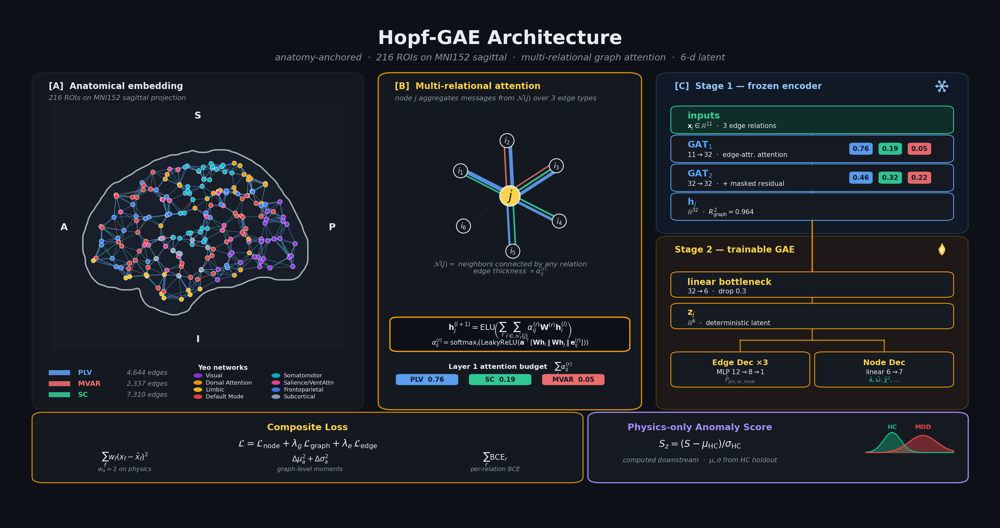

<div align="center">

<picture>
  <source media="(prefers-color-scheme: dark)" srcset="docs/hero_hopf.png">
  
</picture>

# Hopf-GAE
## Physics-Informed Graph Neural Network for Normative Brain Dynamics

### Anomaly Detection in Major Depressive Disorder via Stuart-Landau–Grounded Denoising Graph Autoencoder with Coupled Edge-Node Reconstruction

[](https://www.python.org/) [](https://pytorch.org/) [](https://pyg.org/) []() []() []() []()

</div>

---

## Overview

This repository contains the **Hopf-GAE**, a physics-informed deep learning architecture that detects depression-related dynamical abnormalities without ever training on depressed brains. Rather than framing MDD detection as binary classification (which fails at $n = 19$), the model learns a **normative manifold** of healthy brain dynamics and scores MDD subjects by how far they deviate from it.

The key innovations:

1. **Biophysically grounded node features** — every node carries the per-region bifurcation parameter $a_j$, natural frequency $\omega_j$, and goodness-of-fit $\chi^2_j$ estimated by the Stuart-Landau / Hopf bifurcation framework via the [SL-UKF_Neural_Criticality_MDD](https://github.com/skaraoglu/SL-UKF_Neural_Criticality_MDD) \&  · [SL-UKF_Neural_Criticality_MDDvsHC](https://github.com/skaraoglu/SL-UKF_Neural_Criticality_MDDvsHC) pipeline, plus Yeo 7-network one-hot encodings (11 features per ROI). To our knowledge, the first use of biophysically estimated dynamical parameters as node features in any GNN for fMRI.

2. **Multi-relational graph attention** — three edge types (PLV phase synchrony, MVAR Granger causality, SC structural connectivity) with learned per-relation attention weights and edge-attribute-aware attention.

3. **Coupled edge-node bottleneck** — edge decoders operate on the trainable latent $𝐳$ via concatenation $[𝐳_i \| 𝐳_j]$, creating a gradient path from the edge loss through the shared bottleneck into the node reconstruction pathway. When decoupled (edge decoders on frozen $𝐡$), the connectivity branch has identically zero effect on the anomaly score.

4. **Physics-only scoring** — anomaly scores use reconstruction error on $(a_j, \omega_j, \chi^2_j)$ exclusively. Four additional connectivity-derived features shape $𝐳$ during training but are excluded from the score, preventing connectivity-derived features from diluting the dynamical anomaly signal.

5. **Denoising graph autoencoder** — Gaussian noise injection ($\sigma = 0.1$) on encoder input and dropout ($p = 0.3$) on the latent code replace the variational bottleneck, which collapsed in all tested configurations due to low within-HC variance of bifurcation parameters.

---

## The $n = 19$ Problem

<table>
<tr>
<td width="50%">

**Classification (insufficient data)**
- Binary classification: active NF vs. sham
- Trained on 18 subjects per fold
- Memorized subject identity → Cohen's $d$ of $-6$ to $-11$
- Implausibly large vs. UKF reference $d = -0.835$
- **Verdict:** classification fails at this sample size

</td>
<td width="50%">

**Normative anomaly detection (this work)**
- Train exclusively on healthy controls ($n = 295$ sessions)
- MDD subjects are test-only — never seen during training
- Overfitting eliminated by construction
- HC vs MDD: $d = +3.02$, $p = 7.3 \times 10^{-10}$
- All 4 intervention scales survive FDR correction
- HC holdout false positive rate: 0/36 (0.0%)
- Seed robustness: CV = 3.9% across 10 initializations
- **Verdict:** "how far from healthy?" not "which group?"

</td>
</tr>
</table>

---

## Architecture

<div align="center">

</div>

### Node Features (11-dimensional per ROI)

| Feature | Dim | Source | Meaning |
|---------|-----|--------|---------|
| $a_j$ | 1 | [SL-UKF_Neural_Criticality_MDD](https://github.com/skaraoglu/SL-UKF_Neural_Criticality_MDD) | Bifurcation parameter — distance from critical point |
| $\omega_j$ | 1 | Hilbert phase | Natural oscillation frequency (Hz) |
| $\chi^2_j$ | 1 | UKF fit | Goodness-of-fit (model–data agreement) |
| Network one-hot | 8 | Yeo 7 + Subcortical | Functional network membership |

### Reconstruction Targets (7-dimensional per ROI)

| Feature | Weight | Source | Enters Score? |
|---------|--------|--------|---------------|
| $a_j$ | 2.0 | UKF | **Yes** |
| $\omega_j$ | 1.0 | Hilbert | **Yes** |
| $\chi^2_j$ | 1.0 | UKF fit | **Yes** |
| PLV node strength | 0.5 | Edge aggregation | No — shapes $𝐳$ only |
| MVAR in-strength | 0.5 | Edge aggregation | No — shapes $𝐳$ only |
| MVAR out-strength | 0.5 | Edge aggregation | No — shapes $𝐳$ only |
| Within-network PLV | 0.5 | Edge aggregation | No — shapes $𝐳$ only |

### Edge Types (3 relations)

| Relation | Type | Source | Encoder Weight (Conv₁) |
|----------|------|--------|------------------------|
| **PLV** | Undirected | Phase Locking Value | 0.76 |
| **SC** | Undirected | $\exp(-d/40\text{mm})$ | 0.19 |
| **MVAR** | Directed | Lasso-MVAR | 0.05 |

---

## Model Components

### Multi-Relational Graph Attention Convolution

Each GAT layer maintains separate learnable projections $W_r$ and attention vectors $𝐚_r$ for each edge relation $r \in \{\text{PLV}, \text{MVAR}, \text{SC}\}$, with edge attributes incorporated into the attention computation:

$$h_j^{(l+1)} = \text{ELU}\!\left( \sum_{r \in R} \alpha_r \sum_{i \in \mathcal{N}_r(j)} \alpha_{ij}^{(r)} \, w_{ij}^{(r)} \, W_r \, h_i^{(l)} \right)$$

where $\alpha_r$ are learned relation-importance weights (softmax-normalized).

### Frozen Encoder (5,485 parameters)

Two multi-relational GAT layers ($11 \to 32 \to 32$) with a masked residual connection produce per-ROI embeddings $𝐡_j \in ℝ^{32}$. The masked residual projects the input through `input_proj` ($11 \to 32$) but **zeros the physics features** $(a_j, \omega_j, \chi^2_j)$ — forcing the encoder to reconstruct dynamics through graph message passing rather than shortcutting via identity. A physics head ($32 \to 16 \to 1$) validates the encoder during pre-training ($R^2_{\text{graph}} = 0.964$, $R^2_{\text{roi}} = 0.616$). The encoder is frozen after pre-training.

### Trainable Denoising GAE (586 parameters)

**Denoising:** During training, Gaussian noise ($\sigma = 0.1$) is injected on the encoder input $𝐱$, preventing the bottleneck from learning identity-like mappings.

**Node path:** Deterministic projection $𝐡_j \to z_j \in ℝ^6$ → dropout ($p = 0.3$) → linear decoder ($6 \to 7$) → reconstructed $(a, \omega, \chi^2, s_\text{PLV}, s_\text{MVAR-in}, s_\text{MVAR-out}, \text{PLV}_\text{within})$.

**Edge path (coupled):** Three MLP edge decoders predict edge existence from $[𝐳_i \| 𝐳_j]$ for PLV, SC, and MVAR independently. Each MLP is $12 \to 8 \to 1$ with ELU activation. Concatenation (not absolute difference) is used because directed edges (MVAR) require asymmetric input.

**Graph-level loss:** Per-graph mean and standard deviation of the bifurcation parameter $a$ are reconstructed, ensuring the decoder preserves population-level distributional properties.

| Component | Shape | Parameters | Status |
|-----------|-------|------------|--------|
| $f_z$ (bottleneck) | $32 \to 6$ | 198 | Trainable |
| Linear decoder | $6 \to 7$ | 49 | Trainable |
| Edge decoders (PLV, SC, MVAR) | $12 \to 8 \to 1$ each | 339 | Trainable |
| **Total trainable** | | **586** | |

### Physics-Only Anomaly Scoring

$$S = \frac{1}{N} \sum_{j=1}^{N} \left[ 2(a_j - \hat{a}_j)^2 + (\omega_j - \hat{\omega}_j)^2 + (\chi^2_j - \hat{\chi}^2_j)^2 \right]$$

z-scored against HC norms: $S_z = (S - \mu_\text{HC}) / \sigma_\text{HC}$. No component of the scoring function is derived from or optimized against clinical group membership.

**Loss function (GAE training):**

$$\mathcal{L} = \underbrace{\sum_{f} w_f (x_f - \hat{x}_f)^2}_{\text{feature-weighted node recon}} + \; \lambda_g \cdot \underbrace{(\text{MSE}(\mu_a, \hat{\mu}_a) + \text{MSE}(\sigma_a, \hat{\sigma}_a))}\_{\text{graph-level } a \text{ statistics}} + \; \lambda_e \cdot \underbrace{\sum_{r} \text{BCE}(\hat{A}_r, A_r)}_{\text{3-relation edge recon}}$$

with $\lambda_g = 0.1$, $\lambda_e = 0.5$.

---

## Parameter Budget

```
Total parameters:                            6,071
├── Frozen encoder:                          5,485  (90%)
│   ├── conv1 (3-relation GAT, 11→32):       1,286
│   ├── conv2 (3-relation GAT, 32→32):       3,302
│   ├── input_proj (masked residual, 11→32):   352
│   └── physics_head (32→16→1):                545
└── Trainable GAE:                             586  (10%)
    ├── fc_z (32→6):                           198
    ├── linear_decoder (6→7):                   49
    └── edge_decoders (3 × MLP 12→8→1):        339

Coupled architecture: 3.2× fewer trainable params than decoupled (586 vs 1,882)
```

---

## Data Isolation

```
┌────────────┬─────────────────┬──────────────┬──────────────┬──────────────┬──────────────┐
│  Synthetic │    HC train     │  HC holdout  │   HC test    │  MDD rest1   │  MDD rest2   │
│  n = 200   │ 24 subj (199s)  │ ~5 subj (36s)│ 6 subj (60s) │   19 subj    │   18 subj    │
│  Stage 1   │    Stage 2      │  Test only   │  Test only   │  Test only   │  Test only   │
└────────────┴─────────────────┴──────────────┴──────────────┴──────────────┴──────────────┘
 Synthetic + HC train = train  |  HC holdout + HC test + MDD = never trained on
```

The HC train/test split is **by subject** (not session) to prevent leakage. HC holdout subjects (~15%) provide an unbiased false positive rate estimate (0/36 = 0.0%). MDD subjects are never seen during any training stage. HC train vs. test overfitting check: $p = 0.875$.

---

## Key Design Decisions

**Coupled edge decoders on $𝐳$ (not $𝐡$)** — Edge decoders receive the trainable latent $𝐳$ via concatenation $[𝐳_i \| 𝐳_j]$, creating a gradient path: $∇ℒ_{edge} → MLP_r → [𝐳_i, 𝐳_j] → W_z$. Three independent observations confirm functional coupling: (1) 10% improvement in HC–MDD separation ($d = 2.75 \to 3.02$) with 3.2× fewer trainable parameters; (2) inverted-U dose-response curve for $\lambda_\text{edge}$ peaking at 0.50; (3) optimal $d_z$ shifts from 4 (decoupled) to 6 (coupled). ROI ranking correlation between coupled and decoupled: $\rho = 0.952$.

**Physics-only scoring (not Fisher LDA)** — An earlier design used Fisher LDA to weight anomaly score components, but this introduced circularity: scoring weights were informed by the labels being tested, inflating effect sizes by ~2.8×. The physics-only score is strictly label-free.

**Denoising autoencoder (not variational)** — The variational bottleneck ($\mu, \log\sigma^2$, reparameterization, KL divergence) was tested across multiple architectural configurations. KL collapsed to negligible values in all cases because within-HC variance of $(a, \omega, \chi^2)$ is too low for variational regularization.

**Linear decoder (49 parameters)** — An MLP decoder can learn a mean-output shortcut: memorize the HC population mean and output it regardless of $z$, achieving low reconstruction loss without $z$ carrying per-ROI information. A linear layer cannot learn this shortcut — it must use $z$ to reconstruct per-ROI variation.

**Expanded reconstruction targets (7 features)** — Reconstructing only $(a, \omega, \chi^2)$ allows the bottleneck to ignore connectivity structure. Adding PLV/MVAR-derived features forces $z$ to encode both dynamical and connectivity information per ROI. Only the physics features enter the anomaly score.

**Node-level (not graph-level) bottleneck** — Graph-level pooling into a single $z$ vector could be bypassed by the frozen encoder embeddings. Node-level bottleneck gives each ROI its own $z_j$, forcing per-ROI dynamical information through the bottleneck.

**Concatenation $[𝐳_i \| 𝐳_j]$ (not absolute difference)** — Directed edges (MVAR) require asymmetric input: $[𝐳_i \| 𝐳_j] \neq [𝐳_j \| 𝐳_i]$. Absolute difference would destroy directionality information.

**Feature-weighted reconstruction** — Weights $[2, 1, 1, 0.5, 0.5, 0.5, 0.5]$ on the 7 reconstruction targets emphasize the physics features while still requiring accurate connectivity reconstruction.

**Outlier threshold: HC mean $+ 6 \times$ SD** — Sweeping from 3× to 10× revealed that aggressive thresholds exclude the majority of MDD subjects, while lenient thresholds exclude none. 6× SD removes only genuinely extreme values (1 subject: SA_E4051) while preserving maximum sample size.

---

## Key Results

| Metric | Value | 95% CI | UKF Reference |
|--------|-------|--------|---------------|
| HC vs MDD separation | $d = +3.02$, $p = 7.3 \times 10^{-10}$ | — | — |
| Permutation null (10,000) | $p < 0.0001$ | — | — |
| HC holdout FP rate | 0/36 (0.0%) | — | — |
| HC holdout vs MDD | $d = +2.28$ | — | — |
| Overfitting check | $p = 0.875$ | — | — |
| Seed robustness (10 runs) | $d = 2.91 \pm 0.12$ (CV 3.9%) | — | — |
| Whole-brain intervention | $d = +1.31$, FDR $p = 0.043^*$ | $[0.38, 2.89]$ | $d = -0.84$, $p = 0.080$ |
| Circuit intervention | $d = +1.19$, FDR $p = 0.050^*$ | $[0.33, 2.58]$ | $d = -1.09$, $p = 0.027$ |
| Limbic intervention | $d = +1.32$, FDR $p = 0.043^*$ | $[0.55, 2.43]$ | — |
| Subcortical intervention | $d = +1.61$, FDR $p = 0.042^*$ | $[0.57, 3.98]$ | — |
| Circuit enrichment (top-10) | 2.19× (7/10), hypergeom $p = 0.013$ | — | — |
| Circuit enrichment (top-15) | 2.30× (11/15), hypergeom $p = 0.0008$ | — | — |
| Circuit vs non-circuit | $d = +0.37$, $p = 0.023$ | — | — |
| Heterogeneity (raw $a$, whole-brain) | $d = +1.33$, $p = 0.017$ | — | $d = +1.01$, $p = 0.042$ |
| Heterogeneity (raw $a$, circuit) | $d = +1.44$, $p = 0.008$ | — | $d = +1.01$, $p = 0.042$ |
| #1 anomalous ROI | RH Default PFCdPFCm | — | Converges with Ch. 5 cluster |
| #1 anomalous network | Limbic | — | — |

All four intervention scales survive Benjamini-Hochberg FDR correction. Active group shows approximately stable anomaly (AWAY from HC), sham moves **toward** HC (decreased anomaly). Post-exclusion analysis: $n = 18$ MDD subjects (11 active, 7 sham).

### Per-Feature Decomposition

| Feature | Cohen's $d$ | Direction |
|---------|-------------|-----------|
| $\chi^2$ (model fit) | +6.07 | MDD worse reconstructed |
| $a$ (bifurcation) | +5.91 | MDD worse reconstructed |
| MVAR in-strength | +5.17 | MDD worse reconstructed |
| MVAR out-strength | +4.93 | MDD worse reconstructed |
| $\omega$ (frequency) | −1.76 | MDD *better* reconstructed |
| PLV within-network | +1.43 | MDD worse reconstructed |
| PLV node strength | +1.29 | MDD worse reconstructed |

The reversed sign on $\omega$ is theoretically predicted: MDD alters distance from the bifurcation point without necessarily shifting intrinsic oscillation frequency.

### Top 10 Anomalous ROIs

| Rank | ROI | Network | Circuit? |
|------|-----|---------|----------|
| 1 | RH Default PFCdPFCm | Default Mode | ✓ |
| 2 | LH Limbic TempPole₁ | Limbic | ✓ |
| 3 | LH Limbic TempPole₂ | Limbic | ✓ |
| 4 | LH Default Temp₅ | Default Mode | ✓ |
| 5 | LH Cont Cing₂ | Frontoparietal | |
| 6 | LH Default Par₁ | Default Mode | |
| 7 | RH SalVentAttn FrOperIns₁ | Salience/VentAttn | |
| 8 | NAcc-rh | Subcortical | ✓ |
| 9 | LH Default Temp₃ | Default Mode | ✓ |
| 10 | RH Default PFCdPFCm₃ | Default Mode | ✓ |

### Coupled vs Decoupled Ablation

| Architecture | Trainable Params | HC–MDD $d$ | Edge decoder input |
|-------------|-----------------|-----------|-------------------|
| **Coupled** (edge on $𝐳$) | 586 | +3.02 | $[𝐳_i \| 𝐳_j]$, dim 12 |
| Decoupled (edge on $𝐡$) | 1,882 | +2.75 | $\|𝐡_i - 𝐡_j\|$, dim 32 |

Coupled architecture achieves higher separation with 3.2× fewer trainable parameters.

---

## Upstream Dependencies

The Hopf-GAE consumes outputs from the R biophysical pipeline ([SL-UKF_Neural_Criticality_MDD](https://github.com/skaraoglu/SL-UKF_Neural_Criticality_MDD) \&  · [SL-UKF_Neural_Criticality_MDDvsHC](https://github.com/skaraoglu/SL-UKF_Neural_Criticality_MDDvsHC)):

| Input | File | Format |
|-------|------|--------|
| Bifurcation parameters | `results/v3/sl_stage1_results_216roi.csv` | CSV (one row per ROI per subject per session) |
| PLV matrices | `results/v3/plv/plv_all_216roi.rds` | R list, keyed `"subject_id\|session"` |
| MVAR matrices | `results/v3/s2_mvar_all_216roi.rds` | R list, keyed `"subject_id\|session"` |
| HC comparison data | `results/ch5_v4def/ch5_v4def_results.rds` | R list |

---

## Requirements

<table>
<tr>
<td>

**Python packages**
```
torch, torch_geometric,
numpy, pandas, scipy,
statsmodels, pyreadr,
scikit-learn, matplotlib
```

</td>
<td>

**Upstream (R pipeline)**
```
pracma, MASS, Matrix,
dplyr, tidyr, ggplot2,
scales, glmnet, igraph,
parallel, zoo
```

</td>
</tr>
</table>

**System:** Python ≥ 3.9 · PyTorch ≥ 2.0 · PyTorch Geometric ≥ 2.4 · R ≥ 4.2 (for upstream pipeline only)

---

## Quick Start

```bash
# 1. Ensure upstream pipeline has been run
# (github.com/skaraoglu/UKF-MDD)

# 2. Install Python dependencies
pip install torch torch_geometric pyreadr scikit-learn statsmodels

# 3. Run the full pipeline
jupyter execute main_analysis.ipynb

# Pipeline stages:
#   S1–S6:   Data loading, graph construction, quality control
#   S7–S10:  Synthetic pre-training (encoder, 100 epochs)
#   S11–S12: HC data loading + augmentation, GAE training (200 epochs)
#   S13:     Anomaly scoring (physics-only, z-scored against HC norms)
#   S14:     Statistical analysis (FDR, permutation tests, enrichment)
```

---

## Citation

If you use this architecture or build on this work, please cite:

---

<div align="center">

*Built with [PyTorch Geometric](https://pyg.org/) · Node dynamics from  [SL-UKF_Neural_Criticality_MDD](https://github.com/skaraoglu/SL-UKF_Neural_Criticality_MDD) · [SL-UKF_Neural_Criticality_MDDvsHC](https://github.com/skaraoglu/SL-UKF_Neural_Criticality_MDDvsHC)· Parcellation: [Schaefer 2018](https://github.com/ThomasYeoLab/CBIG/tree/master/stable_projects/brain_parcellation/Schaefer2018_LocalGlobal) + [Melbourne Subcortex](https://github.com/yetianmed/subcortex)*

</div>
